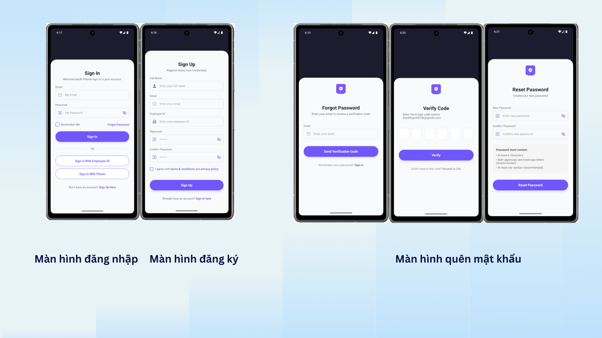
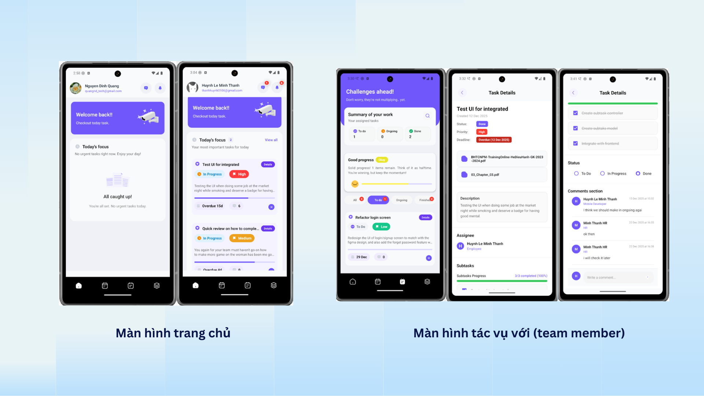
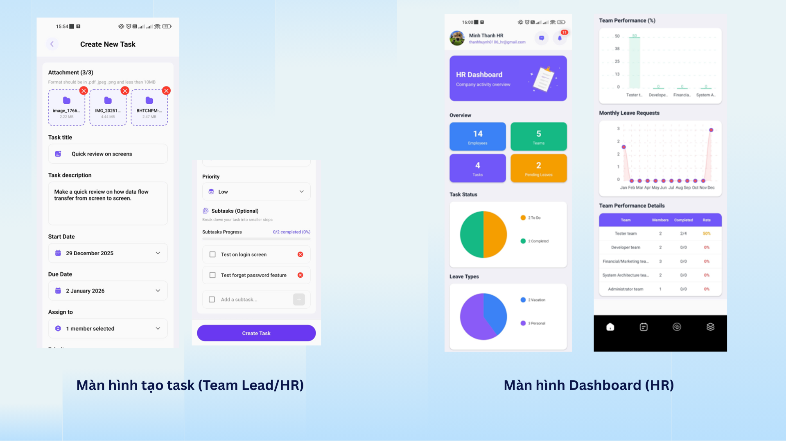
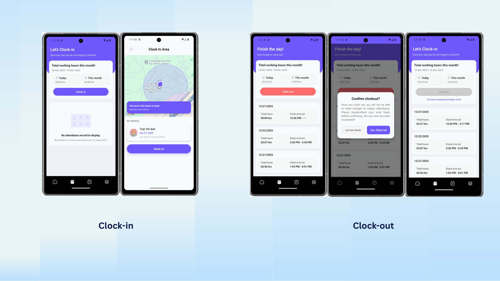
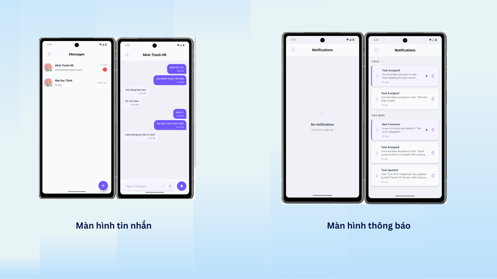

# 📋 Task Management App

A full-stack mobile application for task and attendance management built with React Native and Node.js.

## 🚀 Features

- **Task Management**: Create, update, and track tasks efficiently
- **Attendance Tracking**: Monitor employee attendance with real-time updates
- **Leave Management**: Submit and approve leave requests seamlessly
- **User Authentication**: Secure login and role-based access control
- **File Upload**: Support for document and image uploads

## 🛠️ Tech Stack

### Frontend (Mobile)
- **React Native** - Cross-platform mobile development
- **Expo** - Development and build toolchain
- **MobX/Zustand** - State management (store-based architecture)
- **React Navigation** - Screen navigation

### Backend
- **Node.js** - Runtime environment
- **Express.js** - Javascript framework
- **MongoDB** - Database
- **JWT** - Authentication tokens

## 📁 Project Structure

```
├── client/                 # React Native mobile app
│   ├── src/
│   │   ├── components/     # Reusable UI components
│   │   ├── screens/        # App screens
│   │   ├── navigations/    # Navigation configuration
│   │   ├── services/       # API services
│   │   ├── contexts/       # React contexts
│   │   └── utils/          # Utility functions
│   └── store/              # State management
│
├── server/                 # Node.js backend
│   ├── controllers/        # Request handlers
│   ├── models/             # Database models
│   ├── routes/             # API routes
│   ├── middleware/         # Custom middleware
│   ├── services/           # Business logic
│   └── utils/              # Helper functions
```

## ⚙️ Installation

### Prerequisites
- Node.js >= 16.x
- npm or yarn
- Expo CLI
- MongoDB/MySQL

### Backend Setup
```bash
cd server
npm install
# Configure .env file
npm start
```

### Frontend Setup
```bash
cd client
npm install
# Configure .env file
npx expo start
```

## 📱 Screenshots

<p align="center">
  
  
  
</p>

<p align="center">
  
  
</p>

## 🔧 Environment Variables

### Client (.env)
```
API_BASE_URL=your_api_url
```

### Server (.env)
```
PORT=3000
DB_URI=your_database_uri
JWT_SECRET=your_jwt_secret
```


## 📄 License

This project is licensed under the MIT License.

---

